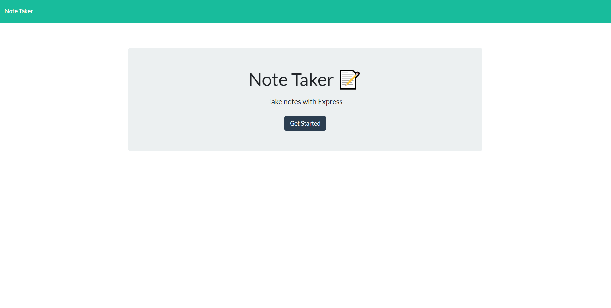
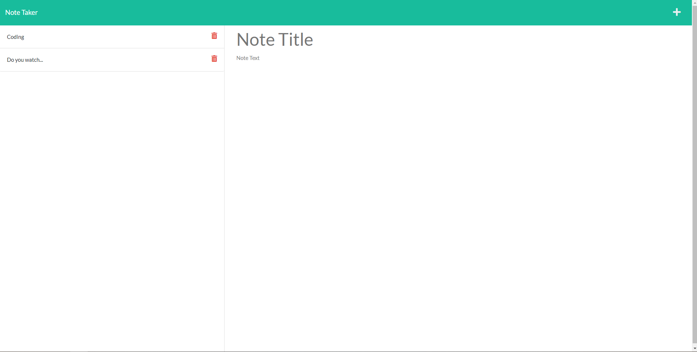
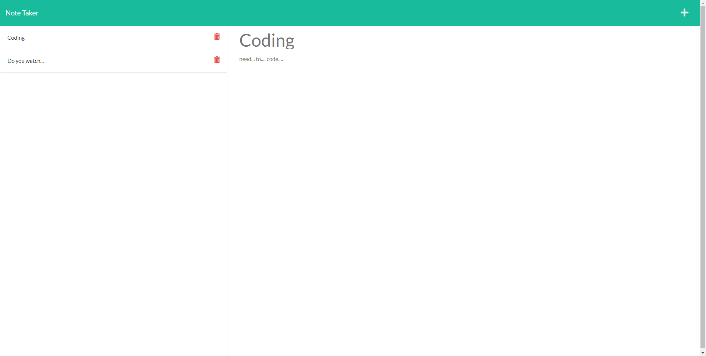

# note-taker


## Description

The main purpose of this project is to create a virtual post-it application called the Note Taker that was made with Express! The user will be able to create new notes, view the active notes, and delete unwanted notes.

You may find the application through Heroku by clicking [here](https://yahplee-note-taker.herokuapp.com/).

## Table of Contents

- [Installation](#installation)
- [Usage](#usage)
- [Questions](#questions)
- [License](#license)
- [Credits](#credits)

## Installation

If you would like to access the app via localhost, you will first need to install the node modules after cloning this repository. Then, you will have to run the following code:

```
npm i
```

After that, the node modules will be installed and run the following code to start the localhost or via nodemon:

```
npm start
```

or

```
npm run watch
```

Then, you can visit [http://localhost:3001](http://localhost:3001) to use the application.

## Usage

Please find a screenshot of the landing page of the application!


Please find a screenshot of the notes page of application!


Please find a screenshot of a specific note!


Once on the notes page, you may create a new note with the "+" button on the top right.

Once entered, you may save the note by pressing the save button next to the "+" icon.

If you would like to delete a note, you may click on the red garbage can button.

## Questions

If you have any questions, please feel free to reach me at:

- GitHub: Yahplee
- Email: [alee68@fordham.edu](mailto:alee@fordham.edu)

## License

This project is nested under the following license: MPL2.0

## Credits

Copyright © Yahplee All rights reserved.
